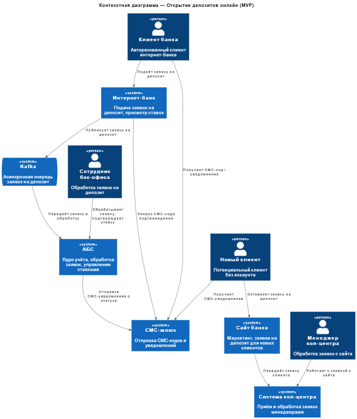
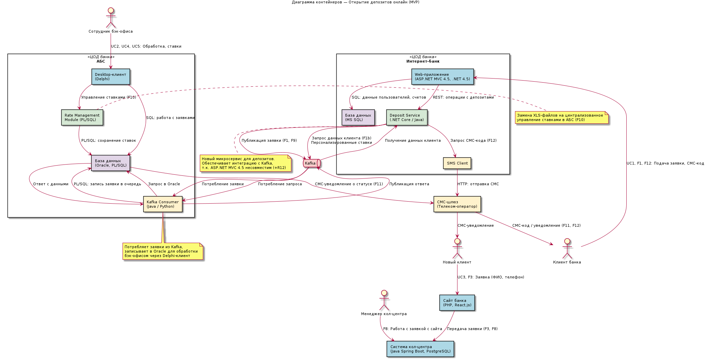

### **Название задачи:**
Открытие депозитов онлайн (MVP)

### **Автор:**
### **Дата:**
03.04.2026

### **Функциональные требования**
Опишите здесь верхнеуровневые Use Cases. Их нужно оформить в виде таблицы с пошаговым описанием:

|**№**|**Действующие лица или системы**|**Use Case**|**Описание**|
| :-: | :- | :- | :- |
| F1 | Клиент (авторизованный) | Подача заявки на депозит в интернет-банке | Заявка обрабатывается бэк-офисом вручную |
| F1a | Клиент (авторизованный) | Отображение списка доступных депозитов с актуальными ставками | Клиент видит все доступные продукты в интернет-банке |
| F1b | Клиент (авторизованный) | Отображение персонализированных ставок для клиента | На основе данных клиента из АБС |
| F3 | Новый клиент (неавторизованный) | Подача заявки на депозит на сайте | Менеджер кол-центра связывается с клиентом |
| F5 | Интернет-банк, АБС | Интеграция интернет-банка с АБС | Получение данных клиента и счетов, синхронизация заявок в АБС для работы сотрудников |
| F8 | Сайт, Система кол-центра | Уведомление кол-центра о заявках с сайта | Для связи с клиентом |
| F9 | Интернет-банк, Бэк-офис | Передача заявок на депозит в бэк-офис | Обработка по старому процессу |
| F10 | Сотрудник бэк-офиса | Управление ставками по депозитам | Замена текущих XLS-файлов на централизованное управление ставками |
| F11 | СМС-шлюз, Клиент | СМС-информирование клиентов | Уведомления о статусе заявок через СМС-шлюз телеком-оператора |
| F12 | Клиент (авторизованный) | Подтверждение операций СМС-кодом | Открытие депозита в интернет-банке |

### **Нефункциональные требования**
Опишите здесь нефункциональные требования и архитектурно значимые требования.

|**№**|**Требование**|
| :-: | :- |
| U1 | Интуитивный интерфейс подачи заявки на депозит — для клиентов старшего возраста |
| U4 | Информативный сайт с маркетинговой информацией — привлечение новых клиентов |
| U5 | Адаптивный дизайн сайта и интернет-банка — для мобильных устройств |
| U6 | Корпоративные цвета банка в интерфейсах — сайт и интернет-банк оформлены в фирменных цветах «Стандарт» |
| U7 | Следование принятой в компании системе дизайна — единый UX-паттерн во всех приложениях банка |
| R1 | Доступность интернет-банка 24/7 — SLA 99.9% для подачи заявок онлайн |
| R2 | Доступность всех сервисов 24/7 — SLA 99.9% |
| R3 | Резервирование в дополнительном ЦОД — аварийное переключение при сбое |
| R4 | Надёжная передача данных в АБС — синхронизация данных клиентов |
| R6 | Защита персональных данных клиентов — соответствие требованиям ЦБ |
| R7 | Шифрование трафика сайта — защита чувствительных данных при передаче |
| R8 | Шифрование трафика интернет-банка — защита данных при передаче |
| P1 | Отклик по всем операциям — миллисекунды (исправление текущей проблемы с загрузкой справочников > 1 сек) |
| P3 | Пропускная способность при пиковых нагрузках — обработка массовых заявок |
| P4 | Равномерное горизонтальное масштабирование — распределение запросов между серверами, приложениями и ЦОД |
| P5 | Защита АБС от перегрузки — асинхронное взаимодействие через Kafka вместо прямых запросов |
| S1 | Возможность доработки интернет-банка — команда банка + подрядчик |
| S5 | Мониторинг и логирование систем — для оперативного выявления проблем |
| S6 | Разработка документации для расширения системы — для дальнейшего развития и поддержки |
| +R1 | Интернет-банк на ASP.NET MVC 4.5 — обновление ядра через подрядчика |
| +R2 | АБС на Oracle/PL-SQL — прямая интеграция с БД |
| +R3 | Система кол-центра на платформе подрядчика — поддержка командой подрядчика (5 чел.) |
| +R4 | Внешний СМС-шлюз телеком-оператора — зависимость от внешнего провайдера |
| +R7 | Срок реализации MVP — 6 месяцев (депозиты с обработкой бэк-офисом) |
| +R8 | Бюджет и ресурсы — 10 человек IT + 10 подрядчик |
| +R9 | Использование совместимых технологий — максимальное применение MS SQL, Oracle и других технологий, совместимых с текущим стеком банка |
| +R10 | Ограничение нагрузки на АБС — запрет прямого взаимодействия, использование Kafka для асинхронности |
| +R12 | Несовместимость текущей версии интернет-банка с Kafka — требуется перевод на микросервисную архитектуру (только для депозитов) |
| +R13 | АБС масштабируется только вертикально — ограничение из-за архитектуры базы данных |
### **Решение**
Приведите диаграммы контекста и контейнеров в модели C4. Опишите там основные компоненты и интеграции всех элементов решения.

Также опишите, какой логикой вы руководствовались в ходе принятия решений и выбора технологий. Не забывайте, что необходимо учесть все функциональные и нефункциональные требования.

#### Диаграмма контекста

Исходный файл: [context_diagram.puml](context_diagram.puml)

#### Диаграмма контейнеров

Исходный файл: [container_diagram.puml](container_diagram.puml)

**Описание контейнеров:**

| Контейнер | Технология | Назначение | Use Case |
|-----------|------------|------------|----------|
| Web-приложение | ASP.NET MVC 4.5, .NET 4.5 | UI для клиентов, отображение депозитов и ставок | F1, F1a, F1b, F12 |
| MS SQL | MS SQL Server | Хранение пользователей, сессий, данных счетов | F1b |
| Deposit Service | .NET Core / Java | Микросервис депозитов, интеграция с Kafka | F1, F5, F9 |
| SMS Client | .NET / HTTP | Запрос СМС-кодов через шлюз | F12 |
| Desktop-клиент | Delphi | Интерфейс бэк-офиса для обработки заявок | UC2, UC4, UC5 |
| Oracle DB | Oracle, PL/SQL | Ядро учёта, заявки, ставки, счета | F5, F9, F10 |
| Rate Management | PL/SQL | Управление ставками (замена XLS) | F10 |
| Kafka Consumer | Java / Python | Чтение заявок из Kafka | F9 |
| Kafka | Apache Kafka | Асинхронная очередь заявок | F1, F9 |
### **Альтернативы**
Опишите здесь наиболее важные альтернативные решения.

#### Альтернатива 1: Прямая интеграция интернет-банка с БД АБС (без Kafka)
**Суть:** Оставить текущую схему — интернет-банк напрямую пишет в Oracle АБС.
**Почему отклонена:** БД АБС уже перегружена, рост заявок создаст риск работоспособности банка. Нарушает +R10.

#### Альтернатива 2: Полная миграция интернет-банка на микросервисы
**Суть:** Перевести весь монолит ASP.NET MVC на микросервисную архитектуру.
**Почему отклонена:** Обновление ядра через подрядчика, большие затраты времени и ресурсов. Для MVP достаточно одного Deposit Service.

#### Альтернатива 3: RabbitMQ вместо Kafka
**Суть:** Использовать RabbitMQ как очередь сообщений.
**Почему отклонена:** В задании указано использовать Kafka на перспективу. Kafka лучше масштабируется, в команде АБС есть Java-экспертиза.

#### Альтернатива 4: Отдельная система управления ставками (не в АБС)
**Суть:** Создать новый сервис для ставок вне АБС.
**Почему отклонена:** Бэк-офис уже работает в АБС (Delphi), процесс согласования там же. Нарушает +R9 — использование существующих технологий.

**Недостатки, ограничения, риски**

Подробно опишите здесь недостатки, ограничения и риски выбранного решения.

#### Недостатки
1. **Сложность:** Kafka + Deposit Service увеличивают количество компонентов для поддержки
2. **Два стека:** Монолит ASP.NET + микросервис — нужно поддерживать оба
3. **Задержка:** Асинхронность означает, что клиент не видит результат заявки мгновенно

#### Ограничения
1. **АБС масштабируется только вертикально** — Oracle не поддерживает горизонтальное масштабирование (+R13)
2. **Зависимость от подрядчика** — обновление ядра интернет-банка требует участия подрядчика (+R1)
3. **Срок MVP — 6 месяцев** — ограниченное время для всех компонентов (+R7)

#### Риски
| Риск | Вероятность | Влияние | Митигация |
|------|-------------|---------|-----------|
| Перегрузка АБС до внедрения Kafka | Высокая | Критическое | Кэширование данных, ограничение частоты запросов |
| Недостаток экспертизы по Kafka | Средняя | Среднее | Обучение, привлечение специалистов команды АБС |
| Потеря сообщений в Kafka | Низкая | Высокое | Репликация, мониторинг очередей |
| Сбой в резервном ЦОД | Низкая | Критическое | Регулярное тестирование переключения |

