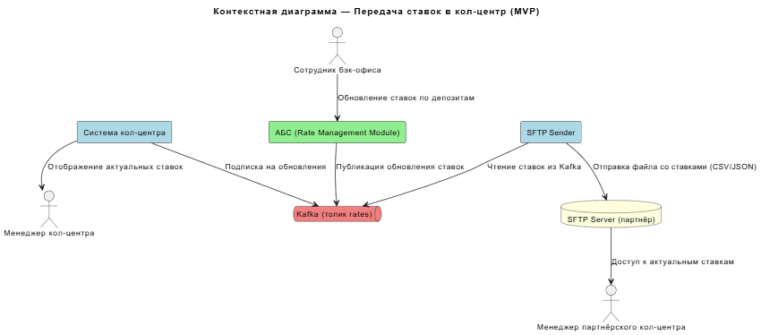
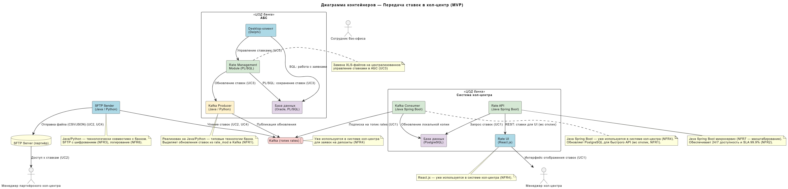

### **Название задачи:**
Передача ставок в кол-центр (MVP)

### **Автор:**
### **Дата:**
03.04.2026

### **Функциональные требования**
Опишите здесь верхнеуровневые Use Cases. Их нужно оформить в виде таблицы с пошаговым описанием:

|**№**|**Действующие лица или системы**|**Use Case**|**Описание**|
| :-: | :- | :- | :- |
| UC1 | Менеджер кол-центра | Просмотр актуальных ставок по депозитам | 1. Менеджер открывает систему кол-центра 2. Система загружает актуальные ставки из Kafka 3. Менеджер видит список депозитов со ставками 4. Менеджер консультирует клиента по телефону |
| UC2 | Менеджер партнёрского кол-центра | Получение файла со ставками по депозитам | 1. Система банка генерирует файл со ставками (CSV/JSON) 2. Файл передаётся через SFTP во внешнюю систему 3. Менеджер партнёрского кол-центра открывает файл 4. Менеджер консультирует клиента по актуальным ставкам |
| UC3 | Сотрудник бэк-офиса | Обновление ставок по депозитам | 1. Сотрудник изменяет ставки в АБС (Rate Management Module) 2. Ставки сохраняются в Oracle 3. Kafka Consumer публикует обновление в топик ставок 4. Система кол-центра получает обновление автоматически |
| UC4 | Система банка | Автоматическая отправка файла ставок партнёру | 1. По расписанию (раз в час/день) система генерирует файл 2. Файл загружается на SFTP-сервер партнёра 3. Партнёр подтверждает получение |

### **Нефункциональные требования**
Опишите здесь нефункциональные требования и архитектурно значимые требования.

|**№**|**Требование**|
| :-: | :- |
| NFR1 | Актуальность ставок в кол-центре — не более 5 минут с момента обновления в АБС |
| NFR2 | Доступность системы кол-центра 24/7 — SLA 99.9% |
| NFR3 | Шифрование SFTP-соединения — защита данных при передаче файлов |
| NFR4 | Использование существующих технологий — Kafka, Java Spring Boot |
| NFR5 | Автоматическая генерация и отправка файлов — без ручного вмешательства |
| NFR6 | Мониторинг доставки файлов — логирование успешных/неуспешных отправок |
| NFR7 | Горизонтальное масштабирование кол-центра — Java Spring Boot микросервисы |
| +R1 | Партнёрский кол-центр — внешняя система, только файловый обмен (SFTP) |
| +R2 | Система кол-центра на платформе подрядчика — поддержка командой подрядчика (5 чел.) |
| +R3 | АБС на Oracle/PL-SQL — генерация ставок через Rate Management Module |
| +R4 | Kafka — уже используется для заявок на депозиты |
| +R5 | Срок реализации MVP — 6 месяцев |

### **Решение**
Приведите диаграммы контекста и контейнеров в модели C4. Опишите там основные компоненты и интеграции всех элементов решения.

Также опишите, какой логикой вы руководствовались в ходе принятия решений и выбора технологий. Не забывайте, что необходимо учесть все функциональные и нефункциональные требования.

#### Диаграмма контекста

Исходный файл: [context_diagram.puml](context_diagram.puml)

#### Диаграмма контейнеров

Исходный файл: [container_diagram.puml](container_diagram.puml)

**Описание компонентов:**

| Компонент | Технология | Назначение | Use Case |
|-----------|------------|------------|----------|
| Rate Management Module | PL/SQL (Oracle) | Управление ставками бэк-офисом | UC3 |
| Rate Publisher | Java / Python | Публикация обновлений ставок в Kafka | UC3 |
| Kafka Topic: rates | Apache Kafka | Топик для распространения ставок | UC1, UC3 |
| Rate Consumer | Java Spring Boot | Потребление ставок из Kafka, хранение в PostgreSQL | UC1 |
| Rate UI | React.js | Отображение ставок менеджерам кол-центра | UC1 |
| SFTP Sender | Java / Python | Генерация и отправка файлов ставок партнёру | UC2, UC4 |
| SFTP Server | Внешний SFTP | Приём файлов партнёрским кол-центром | UC2 |

**Обоснование архитектурных решений:**

**1. Передача ставок в кол-центр через Kafka (NFR1, NFR5)**

Система кол-центра уже на Java Spring Boot с микросервисной архитектурой. Добавление Kafka Consumer — естественное расширение:
- Rate Management Module публикует обновления в топик `deposit-rates`
- Rate Consumer подписывается и обновляет локальную копию в PostgreSQL
- UI получает ставки из локальной БД — отклик в миллисекунды (P1)
- Нет прямой нагрузки на АБС

**2. Передача ставок партнёру через SFTP (+R1)**

Партнёрский кол-центр готов принимать только файлы:
- SFTP Sender генерирует CSV/JSON файл из Kafka или БД кол-центра
- Файл отправляется по расписанию (cron) на SFTP-сервер партнёра
- Шифрование через SFTP (SSH) — NFR3
- Логирование отправок — NFR7

**3. Локальное хранение ставок в кол-центре**

Кол-центр хранит копию ставок в PostgreSQL:
- Независимость от доступности Kafka/АБС
- Быстрый отклик UI (миллисекунды)
- Данные обновляются автоматически при публикации в Kafka

### **Альтернативы**
Опишите здесь наиболее важные альтернативные решения.

#### Альтернатива 1: Прямой запрос кол-центра в АБС за ставками
**Суть:** Система кол-центра напрямую запрашивает ставки из Oracle АБС.
**Почему отклонена:** Нагрузка на АБС (+R10), кол-центр не должен зависеть от доступности АБС.

#### Альтернатива 2: REST API из АБС для получения ставок
**Суть:** Создать REST API в АБС для отдачи ставок.
**Почему отклонена:** АБС на Oracle/PL-SQL, создание API потребует значительных доработок и ресурсов подрядчика.

#### Альтернатива 3: Ручная отправка файлов партнёру
**Суть:** Сотрудник банка вручную формирует и отправляет файл партнёру.
**Почему отклонена:** Риск человеческой ошибки, задержки, нарушение NFR6 (автоматизация).

#### Альтернатива 4: API для партнёрского кол-центра
**Суть:** Создать REST API для партнёра вместо SFTP.
**Почему отклонена:** Партнёр готов принимать только файлы через SFTP (+R1).

**Недостатки, ограничения, риски**

Подробно опишите здесь недостатки, ограничения и риски выбранного решения.

#### Недостатки
1. **Дублирование данных:** Ставки хранятся в Oracle, Kafka, PostgreSQL кол-центра и файлах партнёра
2. **Задержка актуальности:** Партнёр получает ставки по расписанию, не мгновенно
3. **Дополнительный компонент:** SFTP Sender требует поддержки и мониторинга

#### Ограничения
1. **Партнёр — внешняя система:** Нет контроля над процессом получения файлов
2. **Подрядчик кол-центра:** 5 человек на поддержку — ограниченные ресурсы (+R2)
3. **SFTP — только файлы:** Невозможно сделать real-time обновление для партнёра (+R1)

#### Риски
| Риск | Вероятность | Влияние | Митигация |
|------|-------------|---------|-----------|
| Сбой отправки файла партнёру | Средняя | Высокое | Повторные попытки, алерты, ручной fallback |
| Рассинхронизация ставок | Низкая | Среднее | Сверка версий, мониторинг расхождений |
| Перегрузка Kafka | Низкая | Высокое | Мониторинг, масштабирование брокеров |
| Утечка данных через SFTP | Низкая | Критическое | SSH-шифрование, ограничение доступа, аудит |
