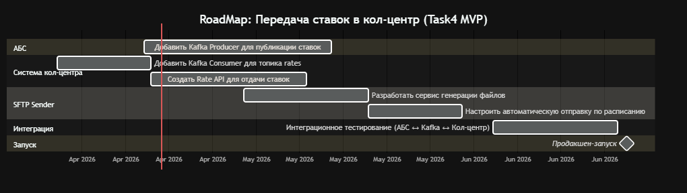

# Task4: Передача ставок в кол-центр (MVP)

## Что нужно сделать

Разработайте ADR для новых изменений. Ещё раз заполните шаблон ADR, на этот раз — для нового кейса. Опишите там Use Cases, функциональные и нефункциональные требования, создайте диаграммы контекста и компонентов в модели C4, опишите альтернативы и недостатки для вашего решения. При разработке диаграмм учитывайте и используйте только то, что имеет значение для текущих изменений.

Сформируйте список крупных задач для каждой системы из ADR для будущего планирования.

Подготовьте RoadMap в draw.io. Это схема последовательности выполнения задач для MVP на горизонте 6 месяцев с учётом изменений в новом кейсе и целевого решения на горизонте года.

## Контекст

Банк «Стандарт» запускает MVP по открытию депозитов онлайн. В качестве дополнения требуется обеспечить сотрудников кол-центра актуальными ставками по депозитам.

### Проблема

Большинство клиентов — пожилые люди. После запуска маркетинговой кампании ожидается рост звонков в кол-центр. Возможны вопросы по ставкам, которые сотрудники не смогут оперативно ответить.

### Требования

1. **Кол-центр банка**: доступ к актуальным ставкам (не более 5 минут задержки)
2. **Партнёрский кол-центр**: получение ставок в виде файлов через SFTP (API недоступно)

### Ограничения

- Партнёрский кол-центр — внешняя система, только файловый обмен (SFTP)
- Система кол-центра на Java Spring Boot (поддержка 5 человек от подрядчика)
- АБС на Oracle/PL-SQL
- Использовать существующий Kafka (уже применяется для заявок на депозиты)
- Срок реализации MVP — 6 месяцев

## Структура решения

Используется существующий Kafka для передачи обновлений ставок:
- **Rate Publisher** публикует изменения из АБС в Kafka
- **Rate Consumer** в кол-центре читает из Kafka и обновляет PostgreSQL
- **SFTP Sender** по расписанию отправляет файлы партнёру

Диаграмма контекста: [context_diagram.puml](context_diagram.puml)

## Диаграммы

- **Контекстная диаграмма**: [context_diagram.puml](context_diagram.puml)
- **Контейнерная диаграмма**: [container_diagram.puml](container_diagram.puml)

## Список задач

### АБС (Oracle/PL-SQL)
- [ ] Выделить Rate Management Module для управления ставками (уже есть в ADR, доработка)
- [ ] Добавить Kafka Producer (Java/Python) для публикации обновлений ставок в Kafka (NFR4, NFR1)
- [ ] Интеграция rate_mod с Kafka Producer через внутренний API

### Система кол-центра (Java Spring Boot/React/PostgreSQL)
- [ ] Добавить Kafka Consumer (Java Spring Boot) для топика rates (уже есть в системе, расширение)
- [ ] Создать Rate API (Java Spring Boot) для отдачи ставок Rate UI (NFR2, NFR7)
- [ ] Обновить Rate UI (React.js) для отображения ставок (NFR4)
- [ ] Хранение копии ставок в PostgreSQL (быстрый отклик мс, NFR1)

### SFTP Sender
- [ ] Разработать сервис генерации CSV/JSON файлов (Java/Python)
- [ ] Настроить автоматическую отправку по расписанию на SFTP партнёра (NFR5)
- [ ] Добавить мониторинг доставки файлов (NFR6)
- [ ] Реализовать шифрование SFTP (SSH, NFR3)

### Партнёрский кол-центр
- [ ] Подготовить SFTP-сервер для приёма файлов
- [ ] Настройка SSH-ключа для аутентификации (NFR3)

## RoadMap

[roadmap.drawio](roadmap.drawio)

---

## Крупные задачи по системам

### АБС (Oracle/PL-SQL)
| Задача | Срок | Ответственный | Комментарий |
|------|------|------|------|
| Выделение Rate Management Module ( dorаботка) | Апрель 2026 | Команда АБС | Выделение модуля из существующей логики |
| Доработка rate_mod для публикации в Kafka | Апрель-Май 2026 | Команда АБС | Подготовка API для Kafka Producer |
| Добавление Kafka Producer (Java/Python) | Май 2026 | Команда АБС | Новый компонент на существующих технологиях |
| Интеграция rate_mod с Kafka Producer | Июнь 2026 | Команда АБС | Связка модуля и брокера |
| Тестирование публикации ставок | Июнь 2026 | QA | Проверка NFR1 (5 мин актуальность) |

### Система кол-центра (Java Spring Boot/React/PostgreSQL)
| Задача | Срок | Ответственный | Комментарий |
|------|------|------|------|
| Добавление Kafka Consumer для топика rates | Апрель 2026 | Подрядчик (5 чел) | Расширение существующей системы |
| Создание Rate API (Java Spring Boot) | Апрель-Май 2026 | Подрядчик | REST API для UI |
| Обновление Rate UI (React.js) | Май-Июнь 2026 | Подрядчик | Отображение ставок в интерфейсе |
| Хранение копии ставок в PostgreSQL | Июнь 2026 | Подрядчик | Локальная БД для быстрого отклика |
| Тестирование API и UI | Июнь 2026 | Подрядчик | Проверка мс отклика (NFR1) |

### SFTP Sender
| Задача | Срок | Ответственный | Комментарий |
|------|------|------|------|
| Разработка сервиса генерации файлов | Май 2026 | Подрядчик | CSV/JSON форматы |
| Настройка автоматической отправки по расписанию | Май-Июнь 2026 | Подрядчик | Cron-задачи (NFR5) |
| Мониторинг доставки файлов (логирование, алерты) | Июнь 2026 | Подрядчик | NFR6 — логирование успешных/неуспешных отправок |
| Тестирование отправки файлов | Июнь 2026 | Подрядчик | Проверка шифрования SFTP (NFR3) |

### Партнёрский кол-центр
| Задача | Срок | Ответственный | Комментарий |
|------|------|------|------|
| Подготовка SFTP-сервера для приёма файлов | Май 2026 | Партнёр | Внешняя система |
| Настройка SSH-ключа для аутентификации | Май 2026 | Партнёр | NFR3 — шифрование соединения |
| Тестирование приёма файлов | Июнь 2026 | Партнёр + Банк | Проверка корректности файлов |

### Общие задачи
| Задача | Срок | Ответственный | Комментарий |
|------|------|------|------|
| Интеграционное тестирование (все компоненты) | Июль 2026 | QA | Проверка совместной работы |
| STAGING-тестирование с подрядчиком | Июль 2026 | Подрядчик + Банк | Экспертная оценка решений |

### Запуск MVP (6 месяцев)
| Ключевая дата | Событие |
|------|------|
| **1 Октября 2026** | Продакшен-запуск (MVP) |
