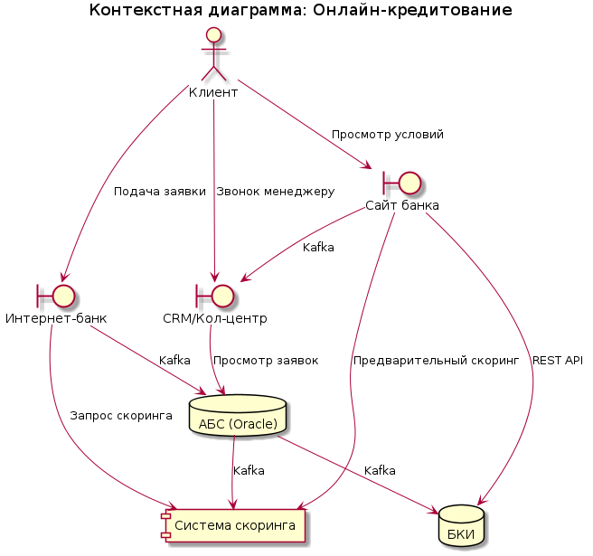
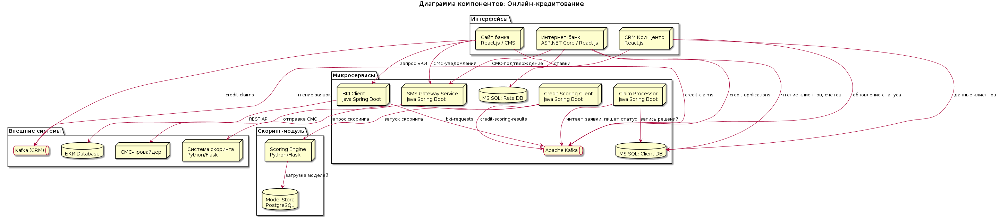

### **Название задачи:**
Онлайн-кредитование: подача заявки через интернет-банк и сайт

### **Автор:**
### **Дата:**
17.04.2026

### **Функциональные требования**
Опишите здесь верхнеуровневые Use Cases. Их нужно оформить в виде таблицы с пошаговым описанием:

|**№**|**Действующие лица или системы**|**Use Case**|**Описание**|
| :-: | :- | :- | :- |
| UC1 | Клиент (физическое лицо) | Подача заявки на кредит через интернет-банк | 1. Клиент входит в интернет-банк 2. Система отображает персональное предложение со ставкой 3. Клиент заполняет минимальную форму заявки 4. Система запрашивает СМС-подтверждение 5. Заявка отправляется в бэкенд через Kafka 6. Клиент получает подтверждение о приеме заявки |
| UC2 | Клиент (физическое лицо) | Подача предварительной заявки на сайте | 1. Клиент заходит на сайт банка 2. Заполняет паспортные данные в форме 3. Система запрашивает данные из БКИ 4. Система запускает предварительный скоринг 5. Отображается предварительное решение (одобрено/отказано) 6. Клиент подтверждает желание подать заявку 7. Заявка отправляется в кол-центр через Kafka |
| UC3 | Кликент (физическое лицо) | Подтверждение заявки и получение СМС-уведомлений | 1. Клиент подает заявку в интернет-банке 2. Система отправляет СМС-код подтверждения 3. После подтверждения: СМС об изменении статуса 4. Каждое изменение статуса заявки — СМС-уведомление 5. При необходимости визита в отделение — СМС-информирование |
| UC4 | Система скоринга | Расчёт рейтинга клиента при подаче заявки | 1. Кredit Scoring Client получает заявку из Kafka 2. Запрашивает данные из АБС и БКИ 3. Отправляет данные в систему скоринга 4. Получает расчёт рейтинга 5. Публикует результат в Kafka 6. Бэк-офис видит результат в интерфейсе |
| UC5 | Сотрудник бэк-офиса | Обработка заявки на кредит | 1. Система бэк-офиса считывает заявки из Kafka 2. Отображаются данные клиента, скоринг, БКИ 3. Сотрудник принимает решение (одобрить/отказать) 4. Решение сохраняется в АБС 5. Статус заявки обновляется через Kafka |
| UC6 | Кол-центр | Получение заявок и связь с клиентом | 1. Сайт отправляет заявку в Kafka (топик credit-claims) 2. CRM кол-центра читает заявки из Kafka 3. Менеджер видит заявку в интерфейсе 4. Менеджер связывается с клиентом 5. При визите клиента в отделение: данные о предварительном одобрении видны менеджеру |
| UC7 | СМС-шлюз | Отправка уведомлений клиентам | 1. Сервис получает команду из Kafka/HTTP 2. Проверяет баланс/доступность 3. Отправляет СМС через телеком-оператора 4. Логирует результат отправки |

### **Нефункциональные требования**
Опишите здесь нефункциональные требования и архитектурно значимые требования.

|**№**|**Требование**|
| :-: | :- |
| NFR1 | Доступность интернет-банка 24/7 — SLA 99.9% (R1, R2) |
| NFR2 | Отклик по всем операциям — миллисекунды (P1). Скоринг-система: отклик < 5 сек (P2) |
| NFR3 | Шифрование трафика сайта и интернет-банка — HTTPS с TLS 1.3 (R7, R8) |
| NFR4 | Асинхронное взаимодействие через Kafka вместо прямых запросов (R5, +R10) |
| NFR5 | Protect АБС от перегрузки — Kafka буферизирует входящие заявки (+R10) |
| NFR6 | Шифрование трафика к БКИ и системе скоринга — HTTPS (R6) |
| NFR7 | Равномерное горизонтальное масштабирование микросервисов (P4) |
| NFR8 | Мониторинг и логирование всех сервисов — для оперативного выявления проблем (S5) |
| NFR9 | Защита персональных данных клиентов — соответствие требованиям ЦБ (R6) |
| NFR10 | Поддержка скоринг-моделей — Python/Flask, внутренняя разработка (S4) |
| NFR11 | Расширяемость системы — микросервисная архитектура Java Spring Boot (S2, S3) |
| +R1 | Интернет-банк на ASP.NET Core / React.js (обновление текущего стенка) |
| +R2 | АБС на Oracle/PL-SQL — только через Kafka для интеграции |
| +R3 | Система скоринга — Python/Flask (внутренняя разработка) |
| +R4 | БКИ — внешняя система, REST API |
| +R5 | СМС-шлюз — внешний телеком-оператор |
| +R6 | Горизонтальное масштабирование скоринга и кредитного конвейера (R14) |
| +R7 | Ограничение предрасчётов — скоринг только при подаче заявки (+R11) |
| +R8 | Использование совместимых технологий — MS SQL, Oracle, Java, Python |

### **Решение**
Приведите диаграммы контекста и контейнеров в модели C4. Опишите там основные компоненты и интеграции всех элементов решения.

#### Диаграмма контекста

Исходный файл: [context_diagram.puml](context_diagram.puml)

#### Диаграмма контейнеров

Исходный файл: [container_diagram.puml](container_diagram.puml)

**Описание компонентов:**

| Компонент | Технология | Назначение | Use Case |
|----------|------------|------------|----------|
| Internet Banking (Web App) | ASP.NET Core / React.js | Интерфейс подачи заявки на кредит в интернет-банке | UC1 |
| Website | React.js / CMS | Маркетинговый сайт и формы предварительной заявки | UC2, UC2a |
| CRM UI | React.js / TypeScript | Интерфейс менеджеров кол-центра для работы с заявками | UC6 |
| Apache Kafka (core) | Apache Kafka | Центральный брокер сообщений для интеграции | UC1-UC7 |
| Apache Kafka (CRM) | Apache Kafka | Брокер сообщений для кол-центра | UC6 |
| MS SQL: Client DB | MS SQL Server | Хранение данных клиентов, счетов, заявок | UC1, UC2, UC5 |
| MS SQL: Rate DB | MS SQL Server | Хранение актуальных ставок по кредитам | UC1 |
| Credit Scoring Client | Java Spring Boot | Микросервис для запроса скоринга | UC4, UC2a |
| Scoring Engine | Python/Flask | Выполнение моделей скоринга | UC4, UC2a |
| Claim Processor | Java Spring Boot | Обработка заявок из Kafka, запись в АБС | UC5 |
| BKI Client | Java Spring Boot | Интеграция с Бюро Кредитных Историй | UC4, UC2a |
| SMS Gateway Service | Java Spring Boot | Отправка СМС-уведомлений клиентам | UC1, UC3, UC6 |
| SFTP Sender (optional) | Java/Python | Генерация и отправка отчетов по заявкам | - |

**Обоснование архитектурных решений:**

**1. Apache Kafka как центр интеграции (R5, NFR4, +R10)**

Все данные о заявках проходят через Kafka:
- Топик `credit-applications` — подача новых заявок
- Топик `credit-scoring-requests` — запросы на скоринг
- Топик `credit-scoring-results` — результаты скоринга
- Топик `credit-status` — обновления статусов
- Топик `bki-requests` — запросы к БКИ
- Топик `credit-claims` — заявки для кол-центра

Блага:
- Асинхронность и буферизация (не перегружает АБС)
- Масштабируемость (Kafka горизонтально масштабируется)
- Надёжность (репликация, персистентность)
- Отказоустойчивость (заявки не теряются при сбоях)

**2. Микросервисная архитектура на Java Spring Boot (+R2, +R6)**

Каждая логическая функция — отдельный микросервис:
- Credit Scoring Client — вызов скоринга
- Claim Processor — обработка заявок
- BKI Client — работа с БКИ
- SMS Gateway — отправка уведомлений

Блага:
- Независимое развёртывание
- Горизонтальное масштабирование (P4)
- Изоляция сбоев
- Легкость тестирования и поддержки

**3. Локальная БД для данных клиента (R4, +R1)**

MS SQL Server хранит:
- Данные клиентов и счетов
- Ставки по кредитам
- Статусы заявок

Блага:
- Скорость доступа (миллисекунды, P1)
- Экономия на прямых вызовах АБС
- Надёжная синхронизация через Kafka

**4. СМС-уведомления через единый шлюз (F11, F12, F16, F18)**

Все СМС идут через микросервис SMS Gateway:
- Подтверждение заявки
- Изменение статуса заявки
- Приглашение в отделение

Блага:
- Единая точка контроля
- Логирование всех отправок
- Переносимость (при смене провайдера только в одном месте)

**5. Двухэтапный скоринг (F6, R5, +R11)**

- **Предварительный скоринг (на сайте):** только данные из БКИ + паспорт
- **Финальный скоринг (в интернет-банке):** полные данные из АБС + БКИ + скоринг

Блага:
- Ускорение UI на сайте (возврат через < 5 сек, P2)
- Защита АБС от нагрузки (только при подаче заявки, +R11)
- Более точное решение на этапе обработки заявки

### **Альтернативы**
Опишите здесь наиболее важные альтернативные решения.

#### Альтернатива 1: Прямой вызов АБС из интернет-банка за заявками
**Суть:** Интерфейс напрямую обращается к Oracle АБС для подачи и проверки заявок.
**Почему отклонена:** Нарушает +R10 — прямая нагрузка на АБС запрещена. Нет асинхронности, риск перегрузки при пиковых нагрузках.

#### Альтернатива 2: Единый monolithic microservice для всех операций
**Суть:** Один микросервис обрабатывает заявки, скоринг, БКИ, СМС.
**Почему отклонена:** Нет масштабируемости — не позволяет горизонтально масштабировать отдельные части. Сложнее поддерживать (S2), нарушает принципы микросервисной архитектуры.

#### Альтернатива 3: БКИ только при финальном скоринге
**Суть:** Не запрашивать БКИ на этапе предварительной заявки.
**Почему отклонена:** F4 требует получать данные только из БКИ для заявок с сайта. Без этого невозможна предварительная оценка (F15, F16).

#### Альтернатива 4: Система скоринга вызывается из АБС
**Суть:** АБС вызывает систему скоринга вместо отдельных микросервисов.
**Почему отклонена:** Нарушает +R10 — перегрузка АБС. АБС должна работать только с традиционными операциями, не синтезированными сервисы.

#### Альтернатива 5: REST API для кол-центра вместо Kafka
**Суть:** Кол-центр опрашивает API банка за новыми заявками.
**Почему отклонена:** Поллинг менее надёжен, чем Kafka. Риск пропуска заявок, сложнее масштабировать. Kafka обеспечивает push-модель с гарантией доставки.

### **Недостатки, ограничения, риски**

#### Недостатки
1. **Дублирование данных:** Клиентские данные в MS SQL, заявки в Kafka, статусы в АБС
2. **Задержка актуальности:** Kafka может иметь задержку до нескольких секунд
3. **Комплексность:** Много взаимодействующих компонентов требует мониторинга
4. **Зависимость от внешних систем:** БКИ, скоринг, СМС-оператор могут быть недоступны

#### Ограничения
1. **Бюджет и ресурсы (+R8):** 10 человек IT + 10 подрядчик на год
2. **Срок реализации:** 1 год после MVP (депозиты)
3. **Интеграция с существующим интернет-банком:** Требуется перевод на ASP.NET Core (с ASP.NET MVC 4.5)
4. **АБС масштабируется только вертикально (+R13):** Нельзя горизонтально масштабировать АБС

#### Риски
| Риск | Вероятность | Влияние | Митигация |
|------|-------------|---------|-----------|
| Сбой Kafka брокера | Низкая | Критическое | Репликация топиков, кластеризация, резервный ЦОД (R3) |
| Перегрузка скоринг-системы | Средняя | Высокое | Лимитирование запросов, очередь в Kafka, кэширование результатов |
| Утечка СМС-ключей | Низкая | Критическое | Хранение в vault, rotation ключей, логирование доступа |
| Недоступность БКИ | Средняя | Высокое | Кэширование последней истории, fallback на ручной скоринг |
| Превышение времени ответа скоринга (>5 сек) | Средняя | Среднее | Таймауты, возврат "в обработке", асинхронная модель |
| Сбой HTTP SSL/TLS для HTTPS | Низкая | Высокое | Использование только TLS 1.3, мониторинг сертификатов |
